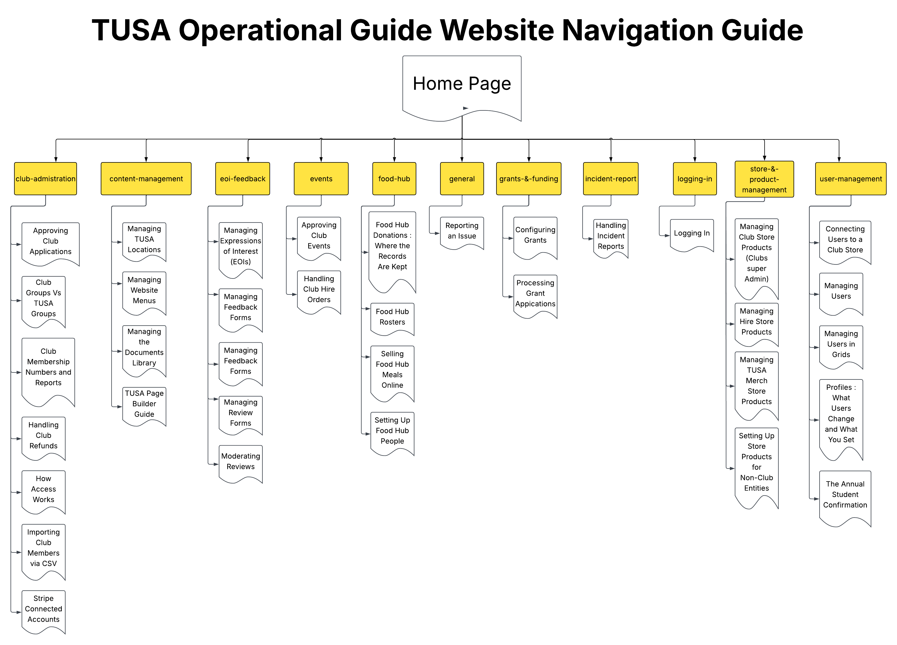

# Welcome to the TUSA Operations Guide

Welcome! The **TUSA Operations Guide** is the central hub for internal documentation, workflows, and standard operating procedures used to manage the TUSA platform.

This site brings together the key guides and processes used across TUSA in one place. 

this edit is done by chris

---

## Navigation Guide

Select a section below to access its documentation.

## Choose a section

- [Club Administration](club-administration/index.md)
- [Content Management](content-management/index.md)
- [EOIs + Feedback](eoi-feedback/index.md)
- [Events](events/index.md)
- [Food Hub](food-hub/index.md)
- [General](general/index.md)
- [Grants & Funding](grants-&-funding/index.md)
- [Incident Reports](incident-report/index.md)
- [Logging In](logging-in/index.md)
- [Store & Product Management](store-&-product-management/index.md)
- [User Management](user-management/index.md)

## Recommended starting points

- **Managing club-related processes?** Start with [Club Administration](club-administration/index.md).
- **Updating website content?** Visit [Content Management](content-management/index.md).
- **Managing events or feedback?** Visit [Events](events/index.md) or [EOIs + Feedback](eoi-feedback/index.md).
- **Managing products or stores?** Visit [Store & Product Management](store-&-product-management/index.md).
- **Managing users and access?** Start with [User Management](user-management/index.md).

## What this site covers

- Club administration and memberships
- Website and content management
- EOIs and feedback
- Events and hire orders
- Food Hub operations
- Grants and funding
- Incident reporting
- Store and product management
- User management and access

